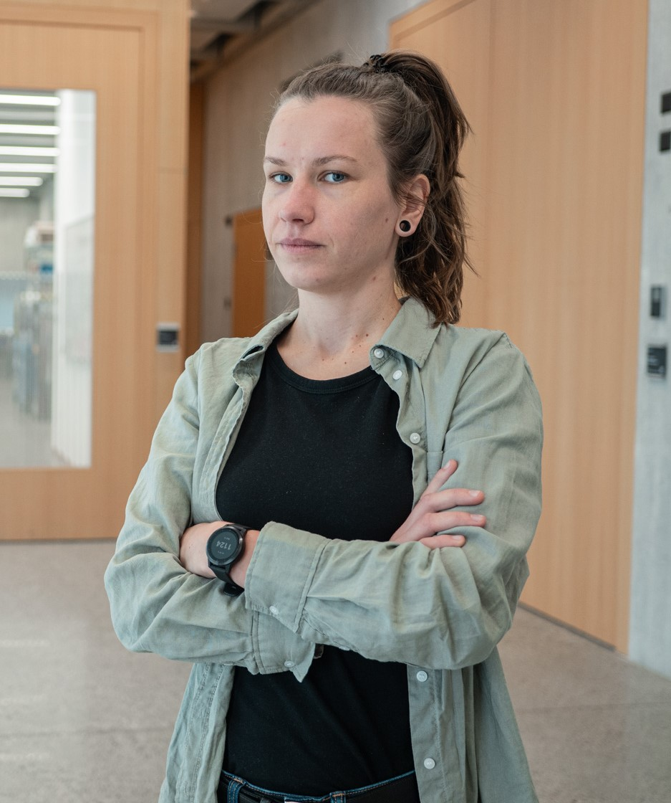

### Personal Information ###

| **Name**               | Radoslava Švihrová
|                        | 
|                        |

### Education ###

| **University**         | 
|                        |
| Sept. 2021-now             | **PhD student**, University of Bern, Switzerland - Cognitive Computational Neuroscience group
|                        |
|June 2023                        | **Prob AI** Summer school on probabilistic modeling, Trondheim, Norway
|                        |
| May 2020             | Diploma (MSc.) in **Statistics**, Johannes Kepler University, Linz, Austria
|                        |
| June 2017              | Diploma (Bc.) in **Mathematics** with focus on economics and banking, Palacký University Olomouc, Czech republic
|                        |

| **High School**         | 
|                        |
| June 2013             | Matura, Billingual grammar school, Liptovský Mikuláš, Slovakia
|                        |

### Work Experience ###

| 2021 - now     |**PhD Student**, Institute for Digital Technologies for Personalized Healthcare, Lugano, Switzerland - Biomedical Signal Processing group

| 2019 - 2021    |**Researcher and Data Scientist**, Software Competence Center Hagenberg, Hagenberg, Austria

| 2017 - 2019    |**Data Science freelancer**

| 2016 - 2019  |**Administrative assistant**, Transformátory, s.r.o., Liptovský Mikuláš, Slovakia

|2012 - 2016    | **Administrative assistant**, Corvinus Travel, s.r.o., Liptovský Mikuláš, Slovakia

#### Seasonal Jobs

|2018 sum.  | allrounder at Hotel Tiefenbach, **Switzerland**

|2017 sum.  | cleaning at Hjá Marlín, **Iceland**

| 2016 win.  | help in service in Restaurant Margaretenhof, **Germany**

|2016 sum.  | allrounder at Tölzer Hütte, **Austria**

|2016 sum.  | fruit picking at farm, **Italy**

|   |

### Computer Skills ###

|**R**            | advanced, active

 |**Python**                      | intermediate, active

|**GitHub**   |intermediate, active

|**C++**                   |beginner

|**SQL**                      |beginner 

|**LaTex**                       |advanced

|**MS Office**       |intermediate

|**Notion**                          |intermediate, learning



###  Competencies in Field

|**Statistical modeling**                          |

|**Bayesian inference**                          |

|**Causal inference**                          |learning

|**Wearables**                          |



### Research Interests

|**Statistical modeling**       |

|**Causal inference**       |

|**Probabilistic models**       |

|**Generative models**       |

|**Wearables**       |

### Memberships

|since 2023       |**Statisticians in the Pharmaceutical Industry**

|since 2023       |**Young Section of the European Sleep Foundation**

### Language Skills

|**Slovak**    |mother language

|**Czech**    |expert

|**English**   |working profficiency

|**German**   |basic communication, learning

|**Polish**   |passive

|**Italian**    |passive, learning

### Publications ###

R. Švihrová, 
   *[Machine Learning Techniques for Intrusion Detection in Network Security](https://epub.jku.at/obvulihs/content/titleinfo/4928712)*, Master Thesis, Johannes Kepler University (2020). 

R. Švihrová, Ch. Lettner,  *[A semi-supervised approach for network intrusion detection](https://www.researchgate.net/publication/343331301_A_semi-supervised_approach_for_network_intrusion_detection)*  Presented at WISI workshop of ARES conference in 2020.
