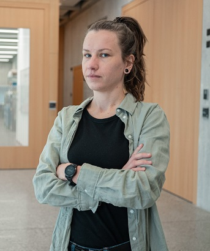

### Personal Information ###

| **Name**               | Radoslava Švihrová (Radka)
| **Based in**           | Zürich, Switzerland (work permit B)
| **Nationality**        | Slovak
|                        | 
| |

### Education ###

| **University**         | 

| 09/2021 - 11/2025             | PhD. in **Computer Science**, University of Bern, Switzerland
|                        |thesis: *Adaptive Interventions and Causal Inference in Digital Health*
| | supervised by [Prof. Dr. Athina Tzovara](https://neuro.inf.unibe.ch/menu/atzovara.html) (UniBE), [Dr. Francesca Dalia Faraci](https://www.supsi.ch/francesca-dalia-faraci) (SUPSI)
|                        |
| 03/2025 - 04/2025      | **Visiting**, Section of Biostatistics, University of Copenhagen, Denmark
| | topic: *Causal discovery and inference from time series data: towards dynamic causal network*
| | with [Assist. Prof. Anne Helby Petersen](https://researchprofiles.ku.dk/en/persons/anne-helby-petersen)
|                        |

| 09/2017 - 05/2020             | MSc. in **Statistics** with focus of Data Science, Institute of Applied Statistics, Johannes Kepler University, Linz, Austria
|                        |thesis *[Machine Learning Techniques for Intrusion Detection in Network Security](https://epub.jku.at/obvulihs/content/titleinfo/4928712)* 
| | supervised by [Assoz. Univ.-Prof.in Mag.a Dr.in Helga Wagner](https://www.jku.at/institut-fuer-angewandte-statistik/ueber-uns/team/assoz-univ-profin-maga-drin-helga-wagner/)
| |
| 09/2013 - 06/2017              | Bc. in **Mathematics** with focus on economics and banking, Palacký University Olomouc, Czech republic
|                        |thesis *Definite integral of single variable function and its applications* 
| | supervised by [Mgr. Iveta Bebčáková, Ph.D.](https://kma.upol.cz/katedra/lide/vizitka/bebcakova/)
| | 

| **Attended courses**  | 

|07/2025              | **Deep Learning Reinforcement Learning** Summer school [certificate](https://certificates.amii.ca/724da39e-acf3-479d-bd77-050580b97c5e#acc.7s1gSqOf), Edmonton, Canada
|04/2025              | **European Causal Inference Meeting** Ghent, Belgium
|04/2024              | **European Causal Inference Meeting** Copenhagen, Denmark
|02/2024              | **Causal Thinking in Clinical Trials** by Basel Biometrics Society, Basel, Switzerland
|06/2023              | **Prob AI** Summer school on probabilistic modeling, Trondheim, Norway
|                     | 

| **Certificates**  | 

|02/2025      | **Data or Specimens Only Research** by CITI program, [certificate](https://www.citiprogram.org/verify/?w7a24a597-7515-46c8-911e-e84506fe319e-67970554) (expires 02/2028)

|09/2021      | **Transfer Learning for NLP with TensorFlow Hub** by Coursera project network, [certificate](https://www.coursera.org/account/accomplishments/verify/4E5E2BB7AAMH)

|11/2020      | **Natural Language Processing with Classification and Vector Spaces** by Deeplearning.AI at Coursera, [certificate](https://www.coursera.org/account/accomplishments/verify/K8GVYC469F4U)

|   |

| **High School**         | 

|06/2013             | Matura, Billingual grammar school, Liptovský Mikuláš, Slovakia
|                        |

### Work Experience ###

| 09/2021 - 09/2025    |**Doctoral researcher**, *University of Applied Sciences and Arts of Southern Switzerland (SUPSI), Lugano, Switzerland - Institute for Digital Technologies for Personalized Healthcare (MeDiTech) - Biomedical Signal Processing group (BSP)*
| | Design and development of personalised adaptive behavioral change support system on top of the existing mHealth solution with utilisation of bandit algorithms and behavioral modelling ([CUOREMA](https://www.cuorema.com/en/) project). 
| | Deriving statistical and causal insights on a personalised and population level from longitudinal data collected with wearable devices, digital diaries, other contextual information and validated questionnaires ([CUOREMA](https://www.cuorema.com/en/), WRSD, MyDoctorLifestyle, RENEWAL projects).
| | Collaborating on writing of ethical proposals and scientific grant proposals. Design of statistical methodology for feasibility studies ([CUOREMA](https://www.cuorema.com/en/), Wearables and well-being projects).
| | Communication and definition of system requirements with healthcare professionals and external industry partners. 
| | Statistical consulting for other projects at the institute. 
| | 

| 06/2019 - 09/2021    |**Researcher and Data Scientist**, *Software Competence Center Hagenberg, Hagenberg, Austria*
| | Data analysis and statistical inference for projects involving collaborators from academia and industry, writting of reports for customers and scientific outcomes, communication with customers. 
| | Design and implementation of machine learning solutions for anomaly and fraud detection in the social contribution system (project together with social insurance in Austria).
| | Design and implementation of machine learning solutions for classification and transfer learning with neural networks for anomaly detection in computer network security ([IoT4CPS](https://iot4cps.at/) project).
| |

| 2017 - 2020   |**Data Science freelancer**
| | Data analysis and statistical inference for semestral projects, academic theses and scientific reports, statistical consulting.
| |

| 2016 - 2019  |**Administrative assistant**, *TPC Transformátory, s.r.o., Liptovský Mikuláš, Slovakia*
| | Communication with customers in English, invoicing.
| |

|2012 - 2016    | **Administrative assistant**, *Corvinus Travel, s.r.o., Liptovský Mikuláš, Slovakia*
|     | English - Slovak translations, assistance in creating website and marketing materials.
| |

#### Teaching Assistant

|2022  - 2025   | **Applied Statistics and Data Analysis** 
|     | semestral master course at SUPSI
|2022  - 2025   | **Artificial Intelligence, Deep Learning & Healthcare** 
|     |1 week summer school at Swiss School of Public Health, organized by BSP-SUPSI
|         |

| **Supervised Theses**  | 

|2024 | **Wearable Data: Towards Data Extraction and Cross Device Feature Mapping Using NLP-Inspired Methods** by Delara Lomen, Bachelor Thesis at the Università della Svizzera italiana
|            | 

|2023 | **Framework for personalized goal recommendation in habit creation. Wearable data analysis and feature extraction** by Jakub Tłuczek, Master Thesis at the University of Neuchâtel
|            |

### Skills ###

|**Active**  | R, Python, MS Office, Latex, Notion

|**Experiences**   | SQL, Git, MongoDB

|   |

#### Seasonal Jobs

|2018 sum.  | allrounder at Hotel Tiefenbach, **Switzerland**

|2017 sum.  | cleaning at Hjá Marlín, **Iceland**

|2016 win.  | help in service in Restaurant Margaretenhof, **Germany**

|2016 sum.  | allrounder at Tölzer Hütte, **Austria**

|2016 sum.  | fruit picking at farm, **Italy**

|   |

### Grants

|2025       |**Travel grant by Faculty of Science, University of Bern**
| | For attendance at the World Sleep Congress 2025 in Singapore

|2025       |**CIFAR travel grant**
| | For attendance at the Deep Learning Reinforcement Learning summer school 2025

|2024       |**UniBE Short Travel Grants for (Post)Docs**
| | For the research stay at the University of Copenhagen in 2025 and attendance of EUROCIM 2025

|2023       |**Labfront: Wearables and well-being**
| | Aiming to understand feasibility of telemonitoring with wearables for well-being
| | Dataset to be published soon.

|   |

### Language Skills

|**Slovak**    |mother language

|**Czech**    |expert

|**English**   |working profficiency

|**German**   |basic communication, learning

|**Italian**    |passive, basics, learning

|   |

### Memberships

|2024 - 2025      |**Statisticians in the Pharmaceutical Industry**

|since 2024       |**Young Section of the European Sleep Foundation**

|since 2024       |**Austro-Swiss Section of International Biometric Society**

|   |

### Scientific input

|02/2025      |**Program committee member** for [Precision Health Day](https://www.supsi.ch/en/giornata-della-salute-di-precisione) 2025, Lugano, Switzerland

|   |